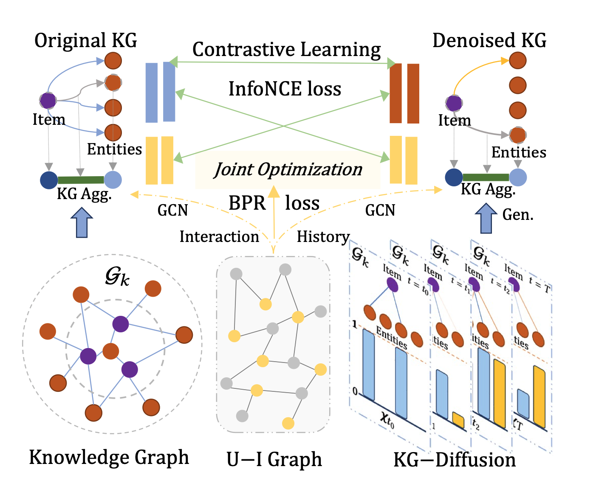

# DiffKG: Knowledge Graph Diffusion Model for Recommendation

This is the PyTorch implementation for **DiffKG** proposed in the paper [**DiffKG: Knowledge Graph Diffusion Model for Recommendation**](https://arxiv.org/pdf/2312.16890.pdf), which is accepted by WSDM 2024 Oral. 

> Yangqin Jiang, Yuhao Yang, Lianghao Xia, and Chao Huang. 2024. DiffKG: Knowledge Graph Diffusion Model for Recommendation. In Proceedings of the 17th ACM International Conference on Web Search and Data Mining (WSDM ’24), March 4–8, 2024, Merida, Mexico. ACM, New York, NY, USA, 9 pages.



In this paper, we propose a novel knowledge graph diffusion model for recommendation, referred to as DiffKG. Our framework integrates a generative diffusion model with a data augmentation paradigm, enabling robust knowledge graph representation learning. This integration facilitates a better alignment between knowledge-aware item semantics and collaborative relation modeling. Moreover, we introduce a collaborative knowledge graph convolution mechanism that incorporates collaborative signals reflecting user-item interaction patterns, guiding the knowledge graph diffusion process.

## 📝 Environment

We develop our codes in the following environment:

- python==3.9.13
- numpy==1.23.1
- torch==1.11.0
- scipy==1.9.1

## 📚 Datasets

| Statistics          | Last-FM         | MIND            | Alibaba-iFashion |
| ------------------- | --------------- | --------------- | ---------------- |
| # Users             | 23,566          | 100,000         | 114,737          |
| # Items             | 48,123          | 30,577          | 30,040           |
| # Interactions      | 3,034,796       | 2,975,319       | 1,781,093        |
| # Density           | 2.7 × $10^{-3}$ | 9.7 × $10^{-4}$ | 5.2 × $10^{-4}$  |
| **Knowledge Graph** |                 |                 |                  |
| # Entities          | 58,266          | 24,733          | 59,156           |
| # Relations         | 9               | 512             | 51               |
| # Triplets          | 464,567         | 148,568         | 279,155          |

## 🚀 How to run the codes

The command lines to train DiffKG on the three datasets are as below. The un-specified hyperparameters in the commands are set as default.

- Last-FM

```python
python Main.py --data lastfm --reg 1e-5 --mess_dropout_rate 0.2 --layer_num_kg 2 --res_lambda 0 --triplet_num -1 --cl_pattern 1 --keepRate 0.1 --e_loss 0.01
```

- MIND

```python
python Main.py --data mind --e_loss 0.1 --temp 1 --ssl_reg 1 --mess_dropout_rate 0.2 --res_lambda 1
```

- Alibaba-iFashion

```python
python Main.py --data alibaba --reg 1e-6 --epoch 50 --ssl_reg 1 --temp 1
```

## 🚀 Run DiffKG via SSLRec

DiffKG has been integrated into [SSLRec](https://github.com/HKUDS/SSLRec)! SSLRec is a PyTorch-based open-source deep learning framework for recommender systems enhanced by self-supervised learning techniques. With SSLRec, you can easily compare our DiffKG with other research works in the field of KG-enhanced recommendation systems.

## 👉 Code Structure

```
.
├── README.md
├── DiffKG.png
├── performance.png
├── Main.py
├── Model.py
├── Params.py
├── DataHandler.py
├── Utils
│   ├── TimeLogger.py
│   └── Utils.py
└── Datasets
    ├── alibaba
    │   ├── trnMat.pkl
    │   ├── tstMat.pkl
    │   └── kg.txt
    ├── lastFM
    │   ├── trnMat.pkl
    │   ├── tstMat.pkl
    │   └── kg.txt
    └── mind
        ├── trnMat.pkl
        ├── tstMat.pkl
        └── kg.txt
```

## 🎯 Experimental Results

Performance comparison of baselines on different datasets in terms of Recall@20 and NDCG@20:


## 🌟 Citation

If you find this work helpful to your research, please kindly consider citing our paper.

```
@article{jiang2023diffkg,
  title={DiffKG: Knowledge Graph Diffusion Model for Recommendation},
  author={Jiang, Yangqin and Yang, Yuhao and Xia, Lianghao and Huang, Chao},
  journal={arXiv preprint arXiv:2312.16890},
  year={2023}
}
```

